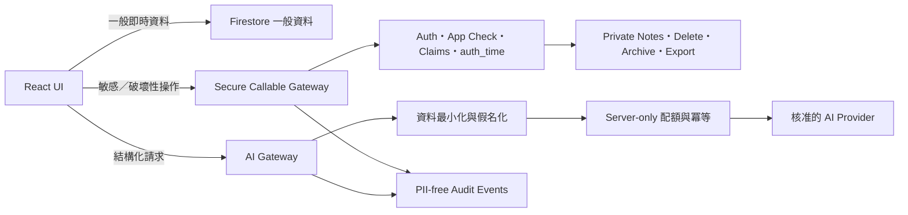

# ClassMate AI 系統強化與優化設計

日期：2026-08-29
狀態：待使用者審閱
設計方向：混合式權威後端（Hybrid Authoritative Backend）

## 1. 背景與設計目的

ClassMate AI 已從單純的班級經營 SPA，成長為包含學生資料、行為與出缺席紀錄、輔導註記、學期封存、AI 評語、課表辨識、匯出、通知與教學網站的完整系統。現有 React、Firebase Authentication、Firestore、Cloud Functions 與 GitHub Pages 技術組合仍適合目前產品，不需要重寫或更換平台；真正需要調整的是控制邊界、資料模型、發布流程與驗證方式。

本設計的首要目標依序為：

1. 確保現有教師資料可讀、可寫、可匯出、可備份、可還原。
2. 維持所有既有功能，不以架構重整為理由刪減教師目前能使用的能力。
3. 將配額、敏感資料、刪除、封存與 AI 隱私政策移到不可由前端繞過的權威邊界。
4. 所有正式資料遷移都可分批、可觀察、可驗證、可中止、可回退。
5. 改善前端載入效能、模組邊界、測試能力、發布一致性與 Guide 維運。

任何系統都不能數學式保證「絕對安全」或永不故障。本設計把這個要求轉換為可驗證的不變條件、分層保護、備份還原、失敗隔離與明確發布門檻，讓風險可被發現、限制及復原。

## 2. 已確認的現況

設計基線為主站提交 `633836aeee8e21b091bc559b0568a965d0cb33e1`，另有尚未提交的五個修改檔：

- `App.tsx`
- `components/Sidebar.tsx`
- `components/StudentDetailWorkspace.tsx`
- `functions/src/index.ts`
- `services/firebaseService.ts`

這些修改包含 React callback/memo 優化、註記同步中止、AI 配額交易、圖片 MIME 驗證與多裝置積分交易修正。它們屬於需要先保存與驗證的既有修正，不應與後續架構遷移混在同一個提交。

目前關鍵結構如下：

- 登入後，瀏覽器直接訂閱 `users/{uid}/students` 完整文件。
- 每位學生的整學期 `dailyRecords` 內嵌在學生文件。
- 一般資料與輔導註記共用同一份學生文件與相同 Firestore 權限。
- 刪除、封存、匯出與輔導紀錄的密碼驗證由瀏覽器流程執行。
- AI prompt 由前端組裝，Cloud Function 接收完整 prompt 後轉送供應商。
- AI 配額由 `users/{uid}/logs` 文件數量計算，但目前規則允許擁有者修改該集合。
- 主站、Cloud Functions、Firestore Rules 與 Guide 沒有共同的 release identity。
- 本機開發程式沒有明確連接完整 Firebase Emulator 組合。
- 主站與 Guide 缺少自動化測試與 lint gate；Guide 目前另有 TypeScript 錯誤。

## 3. 不可違反的系統不變條件

### 3.1 資料可用性

1. 架構遷移期間，教師不得因 schema 版本不同而看不到既有學生或紀錄。
2. 每次正式資料遷移前必須完成可驗證的 Firestore 備份，並在非正式環境完成一次還原演練。
3. 初始遷移專案不得刪除 legacy 資料；legacy 資料保留到切換完成、核對通過、還原演練成功且另行取得刪除核准。
4. 任一新讀取路徑失敗時，必須能在不重新部署前端的情況下退回 legacy 讀取路徑。
5. 任一批次遷移必須可重入；重跑不得重複建立資料或改變已驗證結果。
6. 寫入成功必須有明確伺服器確認；UI 可使用 optimistic update，但錯誤時必須回復並告知教師。
7. 封存、刪除與資料搬移必須具備冪等鍵與稽核事件。

### 3.2 資料完整性

1. 學生總分必須等於可計分事件的聚合結果，或能由事件重新計算。
2. 同一操作在網路重試、雙擊或 Functions 重試時最多生效一次。
3. 多裝置同時加扣分、刪除積分或更新出缺席不得互相覆蓋。
4. 封存必須是可驗證的完整快照；未完成封存不可顯示為成功。
5. 每位使用者的 schema 狀態只能依合法狀態機前進或回退。

### 3.3 隱私與授權

1. 使用者只能存取自己的資料；跨 UID 存取一律拒絕。
2. 配額、稽核、封存完整性與遷移狀態不得由一般客戶端寫入。
3. 輔導註記不得包含在普通學生訂閱中。
4. 敏感讀取與破壞性操作必須由後端驗證近期登入狀態，而非只依賴 React 視窗。
5. AI 預設不得收到學生真實姓名與輔導註記。
6. AI 供應商、傳送欄位與 fallback 行為必須對教師透明且可稽核。
7. 應用程式 log、錯誤追蹤與分析事件不得記錄學生姓名、註記、完整 prompt、圖片或匯出內容。

### 3.4 功能相容性

下列功能在每個發布階段都必須維持可用：

- 登入、既有帳號登入、登出與密碼重設。
- 學生新增、批次匯入、改名、座號、分數與刪除。
- 個別與全班加扣分、積分刪除、快速行為按鈕及獎品商店。
- 出缺席、週／月曆、出席統計與學期判定。
- 評語標籤、AI 評語生成、編輯、複製與研究紀錄。
- 輔導註記新增、修改、同步與匯出。
- 班級與輔導資料匯出。
- 白板、課表、PDF／圖片辨識、範本、時鐘與倒數工具。
- 訂正追蹤、公告通知、全班工具與介面設定。
- 學期封存，以及新增的封存檢視與還原能力。
- Guide 的既有路由、截圖與主要教學內容。

功能相容性指教師工作目的與資料結果維持可用，不代表保留所有不安全的舊行為。兩項刻意收緊的行為是：新帳號註冊後需核准才可存取班級功能；自訂 AI 指示只能補充寫作方向，不能覆蓋系統隱私政策。既有教師帳號與既有資料不受這兩項收緊影響。

## 4. 架構決策

採用混合式權威後端，而不是全部改成後端 API。



### 4.1 保留直接 Firestore 存取的範圍

下列低風險、需要即時更新的資料可繼續由瀏覽器直接讀取，並由細分 Firestore Rules 保護：

- 學生基本資料與非敏感顯示欄位。
- 當日／指定日期的行為與出缺席紀錄。
- 班級設定、白板、課表、訂正與已讀狀態。
- 公告的 authenticated read。

對一般資料保留直接 Firestore 快速路徑，可避免所有畫面都增加 Cloud Function 延遲與成本。

### 4.2 必須進入 Secure Callable Gateway 的範圍

- 讀取與寫入輔導註記。
- 匯出包含輔導或完整班級資料的檔案。
- 學生 soft delete、永久刪除與復原。
- 學期封存、驗證、還原與最終刪除。
- AI 評語與課表辨識。
- 教師准入狀態與管理 claims。
- AI 配額、全域預算與稽核事件。
- schema 遷移與切換狀態。

Gateway 的共用檢查順序固定為：

1. Firebase Auth token。
2. App Check token。
3. 帳號狀態與教師 claim。
4. 資源 UID／studentId 所有權。
5. 需要時檢查 `auth_time`。
6. 輸入 schema、大小、列舉值與狀態轉換。
7. 冪等鍵與配額／成本控制。
8. 執行操作並寫入不含敏感內容的 audit event。

近期密碼驗證後，前端必須呼叫 `getIdToken(true)` 取得反映最新登入狀態的 token，再呼叫敏感 callable。

## 5. 目標資料模型

所有資料仍保留在 `users/{uid}` 下，降低跨租戶規則與遷移複雜度。

```text
users/{uid}
  profile/access
    status: active | pending | suspended
    schemaVersion

  students/{studentId}
    name
    seatNumber
    order
    totalScore
    tags
    comment
    originalAiComment
    deletedAt?

  student_days/{studentId_yyyy-mm-dd}
    studentId
    date
    points[]
    absence
    dailyScore
    updatedAt

  private_notes/{studentId_yyyy-mm-dd}
    studentId
    date
    note
    updatedAt
    version

  settings/config
  corrections/{correctionId}
  read_announcements/state

  archives/{archiveId}
    status: preparing | ready | failed | restored
    archivedAt
    studentCount
    checksum

  archives/{archiveId}/students/{studentId}
    immutable snapshot

  ai_usage/{yyyy-mm-dd}
    reserved
    completed
    failed
    version

  ai_requests/{idempotencyKey}
    status
    inputHash
    provider
    createdAt
    completedAt

  audit_events/{eventId}
    action
    actorUid
    resourceType
    resourceId
    result
    timestamp

  migrations/{migrationId}
    state
    cursor
    counts
    checksums
    startedAt
    completedAt
```

### 5.1 設計取捨

- `student_days` 暫時保留每天一個 points array，而不立即把每筆積分全面 event-source 化。這已能避免整學期資料集中於單一學生文件，同時保留目前 UI 的讀寫模型。
- `private_notes` 與一般日紀錄分離，讓權限、訂閱與資料保留政策可獨立控制。
- `students.deletedAt` 提供 soft delete；永久刪除是另一個受保護流程。
- `ai_usage` 與 `audit_events` 完全禁止客戶端寫入。
- legacy `students.dailyRecords` 在初始遷移範圍內只讀保留，不自動刪除。

## 6. AI Gateway 設計

### 6.1 新請求契約

前端不再傳入完整 prompt，改傳結構化資料：

```typescript
interface GenerateCommentRequest {
  studentId: string;
  wordCount: number;
  stylePreset: string;
  customGuidance?: string;
  includedDayIds: string[];
  includeTeacherObservations: boolean;
  idempotencyKey: string;
}
```

後端依 studentId 讀取允許的資料，自行建立固定 prompt。`customGuidance` 只能補充寫作方向，不能取代固定 system/privacy instruction。

### 6.2 資料最小化

- 真實姓名在送出前替換為短期 placeholder，結果回到可信邊界後才還原。
- 輔導註記永不自動進入 AI prompt。
- 一般教師觀察預設不包含；教師主動啟用時，UI 顯示將傳送的資料類別與供應商。
- 自訂行為標籤與自由文字仍視為敏感輸入，需通過後端 allowlist/classification。
- 只送出生成任務需要的日期與欄位，不送整份學生文件。

### 6.3 配額、冪等與供應商策略

- 每個請求先以 server-only transaction 預留配額。
- `idempotencyKey + inputHash` 相同時回傳既有結果或目前狀態，不再次呼叫供應商。
- 分開記錄 reserved、completed、failed，避免單一 logs 集合同時承擔授權與分析責任。
- 供應商 fallback 僅針對 timeout、暫時性服務錯誤與明確 rate limit；驗證錯誤、政策拒絕或不可重試錯誤不得 fallback。
- 每個供應商有獨立 timeout、circuit breaker 與每日成本上限。
- 在未確認各供應商的學生資料契約前，正式環境預設只啟用一個核准供應商；其他供應商保留為可關閉的緊急設定。

## 7. 帳號與准入策略

為了不破壞既有教師使用權：

1. 遷移前盤點所有既有 UID，將既有有效帳號標記為 `active`。
2. 既有教師不需要重新註冊，也不因新 claims 上線而失去資料。
3. 新註冊帳號建立後為 `pending`，可登入說明頁，但不能讀取班級資料或呼叫 AI。
4. 管理者核准後才授予 teacher claim 與 `active` 狀態。
5. App Check 先以觀察模式記錄，確認所有正式裝置可通過後再強制執行。
6. 帳號停權不得刪除資料；資料保留與刪除是另一個明確流程。

## 8. 零破壞遷移策略

### 8.1 使用者遷移狀態機

```text
legacy
  -> backfill_running
  -> shadow_read
  -> dual_write
  -> v2_primary
  -> verified

任一中間狀態可回到 legacy 或前一穩定狀態。
```

狀態只能由後端管理。前端透過遠端 feature flag 取得目前讀取模式，不自行判斷 schema。

遠端切換值儲存在 `users/{uid}/profile/access`，欄位為 `schemaReadMode` 與 `schemaWriteMode`；一般客戶端只能讀取，只有 Admin SDK 可寫。允許值固定為 `legacy`、`shadow`、`dual`、`v2`，未知值一律安全退回 `legacy`。

### 8.2 遷移步驟

1. 建立 production Firestore export，保存 export ID、時間、專案與物件數量。
2. 將相同 export 還原到 staging，執行完整 smoke、數量與 checksum 核對。
3. 在 production 新增 v2 collection 與新 Rules，但不切換任何讀取路徑。
4. 使用冪等 backfill job 逐帳號複製 dailyRecords 與 private notes；legacy 仍是唯一來源。
5. 對每位教師核對學生數、日期數、積分筆數、分數、出缺席與註記 checksum。
6. 啟用 shadow read：正式 UI 仍使用 legacy，背景只比較 v2 結果且不顯示給教師。
7. 只有零差異帳號才能進入 dual-write。任何寫入同時更新 legacy 與 v2，並監測差異。
8. 先以內部／測試帳號切到 v2 primary，再以小批既有教師逐步切換。
9. v2 讀取發生錯誤或差異時，feature flag 立即退回 legacy，不需要等待重新部署。
10. 所有帳號通過觀察期與還原演練後標記 verified。
11. 本專案初始範圍不刪除 legacy dailyRecords；移除 legacy 必須是獨立、再次核准的後續專案。

### 8.3 核對規則

每位使用者至少核對：

- 學生 ID 集合、姓名、座號與順序。
- 每位學生的總分。
- 每個日期的 point ID、label、value、timestamp。
- 出缺席類型。
- 輔導註記內容 checksum；不得把內容寫進 migration log。
- AI 評語、原始評語與 tags。
- 班級設定、課表、白板、訂正與公告已讀狀態。
- 封存學生數及 snapshot checksum。

所有 mismatch 只記錄資源 ID、欄位名稱與雜湊，不記錄敏感欄位內容。

checksum 使用 canonical JSON：物件 key 依字典序、point 依 point ID 排序、時間與數值使用原始型別，再以 SHA-256 計算。legacy 與 v2 必須使用同一份純函式產生 digest；輔導註記只保存 digest 比對結果，不把原文寫入 migration 或 application log。

## 9. 封存、刪除與復原

### 9.1 學期封存

- callable 先建立 `preparing` archive。
- 逐項建立 immutable snapshot 並計算 checksum。
- 全部核對通過才將狀態改為 `ready`。
- 只有 `ready` archive 存在時才允許重設本學期資料。
- 任一步驟失敗保留原資料並將 archive 標記為 `failed`，不得清空學生資料。

### 9.2 學生刪除

- UI 的「刪除」改為 soft delete，預設可復原。
- 永久刪除要求近期驗證、明確再次確認、已完成備份及後端 audit event。
- 學生被 soft delete 後不出現在正常名單，但匯出與復原工具可依權限查看。
- 永久刪除流程必須包含所有關聯日紀錄、私密註記、訂正與 AI metadata，避免孤兒資料。

## 10. 前端與模組優化

### 10.1 模組邊界

逐步建立下列 feature 目錄，而不是一次重寫：

```text
features/
  students/
  behavior/
  attendance/
  counseling/
  ai-comments/
  archive/
  whiteboard/
  notifications/

repositories/
  studentsRepository.ts
  studentDaysRepository.ts
  privateNotesGateway.ts
  archiveGateway.ts
  aiGateway.ts
```

元件只依賴 repository/gateway interface，不直接拼接 Firestore path。遷移時可在 interface 後切換 legacy、dual 或 v2 實作。

### 10.2 效能優化順序

1. 將 `xlsx` 改為匯出時動態載入。
2. 將 StudentDetail 與 Whiteboard 工作區改為 route/state-based lazy loading。
3. 將 PDF.js worker 隨應用程式打包，不依賴執行期 CDN。
4. 以 CSS variables 取代動態 Tailwind `hover:${theme.*}` class。
5. 拆分 `StudentDetailWorkspace`、`Sidebar` 與 `firebaseService`，讓資料訂閱與重渲染範圍可測量。
6. 建立 bundle report、Firestore read count 與 Web Vitals 基線後，再決定是否需要列表 virtualization 或更進階快取。

不在本設計中引入 Redux、Next.js、微服務、替代資料庫或全面 event sourcing。

## 11. 錯誤處理與離線行為

- 寫入錯誤使用一致的 domain error code，UI 不直接顯示 Firebase 或供應商原始訊息。
- optimistic update 必須保存 previous state，失敗後復原並顯示可重試提示。
- callable 支援 idempotency key；客戶端 timeout 後可安全查詢原請求狀態。
- 不在初始階段啟用持久 Firestore offline cache，避免共用教師電腦留下敏感資料。
- 網路中斷時允許查看目前記憶體中的一般資料，但私密註記不建立長期本機快取。
- UI 必須區分「已儲存」「等待同步」「同步失敗」，不得把 local state 當成已成功寫入。
- 登出時清除敏感 React state、暫存匯出資料、AI prompt/result 與任何 session cache。

## 12. 環境與發布設計

### 12.1 環境隔離

- Development：Auth、Firestore、Functions Emulator。
- Staging：獨立 Firebase project、合成測試資料與測試帳號。
- Production：只接受受保護的 CI workflow 或明確核准的 operator deploy。
- 每個環境顯示明確 banner 與 project identity。
- capture、seed、migration 與 destructive scripts 若偵測到 production project，預設拒絕執行；正式操作需要獨立人工核准旗標與目標確認。

### 12.2 統一 release manifest

每次發布產生：

```json
{
  "releaseId": "immutable-id",
  "appCommit": "git-sha",
  "guideCommit": "git-sha",
  "functionsCommit": "git-sha",
  "rulesHash": "sha256",
  "schemaCompatibility": [1, 2],
  "builtAt": "ISO-8601"
}
```

正式發布順序為：

1. 靜態檢查與全部測試。
2. 建置主站、Guide 與 Functions。
3. 部署 staging Functions／Rules。
4. staging migration rehearsal 與 smoke test。
5. 建立 production backup。
6. 部署向後相容的 production Functions／Rules。
7. 部署主站與 Guide。
8. production read-only smoke test。
9. 小批 feature flag 啟用。
10. 監測並決定擴大、暫停或回退。

前端版本必須可與前一版 Functions／Rules 相容；Functions／Rules 也必須在前端更新前接受舊版請求，避免發布過程短暫失配。

## 13. 測試與發布門檻

### 13.1 自動測試層級

- Unit：日期、學期、積分、資料轉換、checksum、prompt policy 與 idempotency。
- React component：登入、學生操作、密碼驗證、寫入狀態、錯誤復原與 AI UI。
- Firestore Rules Emulator：跨 UID、private notes、quota、audit、archive 與 migration state。
- Functions integration：近期驗證、配額並行、重試、退款、fallback、封存與 restore。
- Migration tests：同一 fixture 重跑、部分失敗續跑、checksum mismatch、回退與 legacy fallback。
- Browser smoke：主站登入、匯入、加扣分、請假、註記、AI、匯出、封存；Guide 全路由與圖片。
- Accessibility：鍵盤焦點、dialog、表單 label、`aria-expanded` 與色彩對比。

### 13.2 不得發布的條件

- 主站、Functions 或 Guide TypeScript 失敗。
- 任一跨 UID Rules test 失敗。
- 客戶端可寫 quota、audit、archive integrity 或 migration state。
- recent-auth 測試可被普通登入 session 繞過。
- AI request snapshot 預設包含真實姓名或輔導註記。
- migration fixture 出現資料數量或 checksum 不一致。
- staging backup restore 未完成或 production backup 不存在。
- 新版無法退回 legacy read mode。
- 核心既有功能 smoke test 失敗。

## 14. 可觀測性與告警

收集但不包含學生內容的指標：

- 登入與准入失敗類型。
- Firestore permission denied 數量。
- callable 成功率、延遲、重試與 idempotency hit。
- AI 供應商、fallback、timeout、配額拒絕與成本單位。
- migration 狀態、處理數、差異數與回退次數。
- archive preparing／ready／failed 數量與耗時。
- 前端 error boundary、版本、bundle 與 Web Vitals。
- 主站、Guide、Functions 與 Rules release identity 不一致。

告警不得攜帶姓名、註記、完整 prompt、base64 圖片或匯出內容。

## 15. Guide 與文件同步

- Guide 與主站使用相同 release manifest。
- 外部 Guide checkout 必須固定 commit，不建置未審核的 default branch 最新狀態。
- Guide build 必須包含 typecheck、未知路由 404、圖片存在與連結測試。
- capture 只允許在 emulator 或 staging 執行。
- 功能 metadata 至少記錄功能名稱、route、所需權限、Guide route、截圖版本與首次支援 release。
- AI 供應商、資料類別、配額與隱私說明必須與正式行為一致。

## 16. 分解後的工作流

此設計是跨子系統的 umbrella specification，不應合成一個巨大實作提交。核准後依序建立獨立 implementation plan：

### 工作流 A：保存基線與測試地基

- 將現有五檔修正拆成可審查提交。
- 建立 dev/staging/prod 隔離。
- 建立 Vitest、Rules Emulator、Functions integration 與 browser smoke 骨架。
- 修復 Guide TypeScript，加入共同 build gate。
- 建立 release manifest。

### 工作流 B：權威安全邊界

- quota/audit server-only Rules。
- 教師准入、App Check 漸進啟用。
- recent-auth callable framework。
- soft delete、archive state machine 與 audit event。

### 工作流 C：AI Gateway

- 結構化 DTO 與 server-owned prompt。
- 假名化、資料最小化、冪等與成本控制。
- provider policy、timeout、circuit breaker 與 privacy UI。

### 工作流 D：資料 schema v2 與遷移

- repository interface。
- student_days/private_notes schema。
- backup、backfill、shadow read、dual write、逐帳號切換與回退。
- archive restore 與 legacy 保留。

### 工作流 E：前端效能與可維護性

- bundle lazy loading 與 PDF worker。
- CSS variable theme。
- StudentDetail、Sidebar 與 service 拆分。
- 實際效能與 Firestore 成本量測。

### 工作流 F：Guide、無障礙與發布收斂

- Guide 內容與現有功能同步。
- route/assets/a11y 測試。
- 固定 Guide revision、統一 production smoke 與 release parity 告警。

每個工作流都必須有自己的驗收條件、回滾步驟與獨立提交，不跨工作流順手重構。

## 17. Rollout 與 rollback 原則

- 所有行為變更先由 feature flag 關閉上線。
- 新 Rules 必須先向後相容，不能先封鎖仍在使用舊版前端的教師。
- 新 callable 上線後先由 staging 與測試帳號驗證。
- schema 切換以 UID 為單位，不進行全體瞬間切換。
- 任何資料 mismatch、錯誤率異常或教師功能 smoke failure 都自動停止擴大。
- rollback 優先切 feature flag／schema read mode，不先回滾資料。
- 回滾程式不得刪除 v2 或 legacy 資料，只切換權威讀取來源。
- 若 rollback 後發生雙寫差異，以 audit、idempotency records 與人工核對工具產生修復建議，不自動覆寫教師資料。

## 18. 主要風險與處理

| 風險 | 防護方式 |
|---|---|
| 未提交修正與架構改動混雜 | 先保存、測試並單獨提交現有修正 |
| 新 Rules 封鎖舊前端 | Rules/Functions 先保持向後相容，前端最後切換 |
| backfill 遺漏或重複 | 冪等 deterministic ID、cursor、count 與 checksum |
| dual-write 部分成功 | server-owned operation、狀態紀錄、重試與 mismatch monitor |
| 教師突然失去帳號權限 | 既有 UID 預先 active，claims 先觀察再強制 |
| AI 隱私強化降低評語品質 | 用結構化非敏感行為摘要取代姓名與私密註記，staging 比較品質 |
| callable 增加延遲 | 只將敏感與權威操作後端化，一般即時讀取保留 Firestore |
| logging 再次外洩敏感資料 | 欄位 allowlist、內容禁止規則與 log snapshot tests |
| 遷移後無法快速回退 | 遠端 schema flag、legacy 保留與讀取 fallback |
| Guide 與主站再次不同步 | release manifest、固定 SHA 與 CI route/content gate |

## 19. 成功判定

本計畫完成時，必須同時達到：

1. 所有既有教師帳號與功能通過相容性測試。
2. 備份可在 staging 還原，抽樣與全量 checksum 驗證通過。
3. 一般客戶端無法修改 quota、audit、archive integrity 與 migration state。
4. 普通登入 session 無法繞過 private note、delete、archive 或完整 export 的近期驗證。
5. AI 預設 request 不包含姓名與輔導註記，供應商與資料類別可被教師理解。
6. 並行、雙擊與重試測試不會重複計分、刪除、封存或扣配額。
7. 每位教師可獨立切換 v2 或退回 legacy，且 legacy 資料仍保留。
8. 主站、Guide、Functions 與 Rules 有一致可查的 release identity。
9. 主站、Functions 與 Guide build/typecheck/test 全數通過。
10. 正式環境可監測錯誤、配額、migration、archive 與 release parity，且監測資料不含學生內容。

## 20. 非目標

- 不改寫為 Next.js 或其他前端框架。
- 不更換 Firebase、Firestore 或 GitHub Pages。
- 不導入微服務、Redux 或新的通用狀態管理框架。
- 不在第一階段刪除 legacy dailyRecords。
- 不在缺乏實際量測前導入列表 virtualization、複雜快取或全面 event sourcing。
- 不把所有一般讀取強制改為 Cloud Functions。
- 不在本設計中直接執行正式資料遷移或正式部署。

## 21. 核准後的下一步

本規格核准後，第一份 implementation plan 只處理「工作流 A：保存基線與測試地基」。完成並驗證 A 後，才依序規劃 B 至 F。這個順序確保任何安全、資料或架構改動前，系統已有可重複的功能驗證、環境隔離與發布回退能力。
